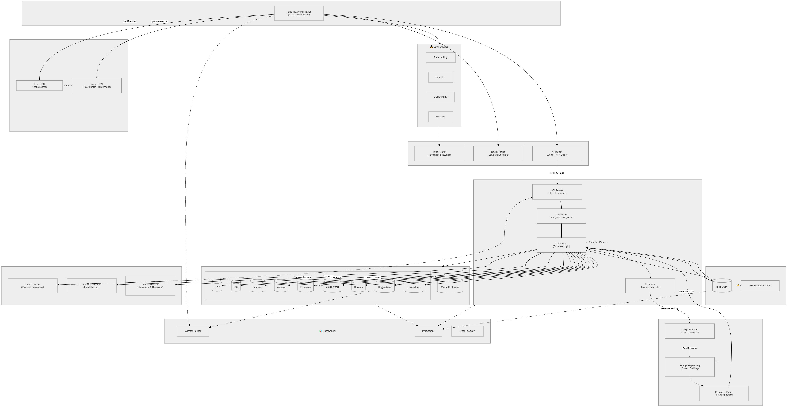
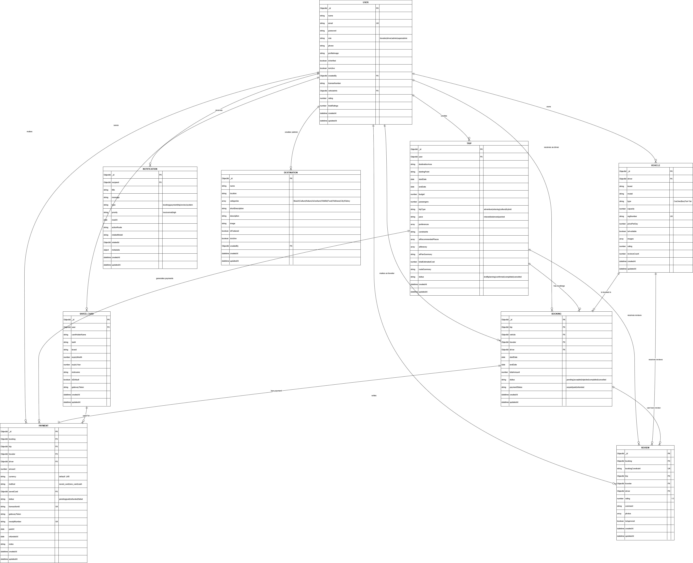

# WanderWay

> AI-powered Travel Itinerary Planner for Sri Lanka & Beyond

---

## 01. GitHub Repository Link

🔗 **GitHub Repo:** [https://github.com/MenuraDev/WMT-TripIQ.git](https://github.com/MenuraDev/WMT-TripIQ.git)

---

## 02. Team Details

**Group Number:** Y2-S2-WD-AI-01-G15

| Name  | IT Number | Module |
|------|-----------|--------|
| Aruniya N. | IT24103971 | Destination Information Module |
| Peiris W.A.H. | IT24103139 | User Dashboard & Trip Booking |
| Assalaarachchi B.T | IT24102180 | Driver Dashboard |
| Wijekoon L.P.L.N. | IT24100178 | Payment System |
| Jayaweera M.K.D. | IT24102972 | Admin Dashboard |
| Menura Lakvindu T.G. | IT24102365 | Review & Rating System |

---

## 03. Deployment Details

- **Backend URL:** [https://your-api-link](https://your-api-link)
- **API Documentation:** [https://your-api-link/docs](https://your-api-link/docs)

---

## 04. Project Overview

**Problem Statement:**
Planning a trip can be overwhelming and time-consuming. Travelers often struggle with creating optimized itineraries that fit their budget, preferences, and time constraints. They need to research destinations, calculate costs, plan daily activities, and coordinate transportation—all while ensuring the trip stays within budget. This fragmented planning process leads to suboptimal travel experiences and missed opportunities.

**How AI Solves It:**
WanderWay leverages Groq's fast LLM inference to generate personalized, day-by-day travel itineraries in seconds. Users input their destination, travel dates, budget, number of passengers, preferences (adventure, relaxing, cultural, or hybrid), and pace (relaxed, balanced, packed). The AI then recommends the best places to visit with coordinates, entry fees, and confidence notes, followed by a practical daily itinerary with activities, accommodations, meals, and estimated costs. The system ensures the total cost aligns with the user's budget while providing realistic, location-specific recommendations.

**Target Users:**
- **Travelers:** Individuals or groups planning trips who want AI-generated itineraries tailored to their preferences and budget
- **Drivers:** Local drivers who can register their vehicles and offer transportation services for booked trips
- **Admins:** Platform administrators who manage users, trips, bookings, payments, and reviews
- **Super Admins:** System administrators with full access to manage all aspects of the platform

---

## 05. System Architecture



**Main Components:**

1. **Frontend (React Native + Expo):**
   - Mobile application built with Expo Router
   - Supports iOS, Android, and web platforms
   - Features role-based navigation (traveler, driver, admin)
   - Real-time notifications and booking management
   - Theme support (light/dark mode)

2. **Backend (Node.js + Express):**
   - RESTful API architecture
   - JWT-based authentication and authorization
   - Role-based access control (traveler, driver, admin, superadmin)
   - File upload handling via Cloudinary
   - Real-time notification system

3. **AI Model (Groq LLM API):**
   - Integration with Groq SDK for fast LLM inference
   - Custom prompt engineering for travel itinerary generation
   - JSON response parsing and validation
   - Personalized recommendations based on user preferences

4. **Database (MongoDB):**
   - NoSQL document database via Mongoose ODM
   - Collections for users, trips, bookings, vehicles, payments, reviews, destinations, and notifications
   - Indexed queries for performance optimization
   - Schema validation and relationships

---

## 06. Database Schema



**Key Collections:**

| Collection | Description |
|------------|-------------|
| `users` | User accounts with roles (traveler, driver, admin, superadmin), profile info, ratings |
| `trips` | AI-generated itineraries with recommended places, daily activities, budget breakdown |
| `bookings` | Trip bookings linking travelers, drivers, trips, and vehicles with status tracking |
| `vehicles` | Driver vehicle information including type, capacity, pricing, availability |
| `payments` | Payment records with method, status, transaction IDs, and refund tracking |
| `savedCards` | Encrypted saved payment cards for quick checkout |
| `reviews` | User reviews and ratings for drivers and trips with photo uploads |
| `destinations` | Featured destinations with categories, images, and descriptions |
| `notifications` | In-app notifications with priority, read status, and action routes |

---

## 07. API Endpoints (Summary)

See full table in [`API_Endpoint_Table.pdf`](./API_Endpoint_Table.pdf)

| Method | Endpoint | Description | Auth Required |
|--------|----------|-------------|---------------|
| POST | `/api/auth/register` | Register new user (traveler/driver) | ❌ |
| POST | `/api/auth/login` | Login and receive JWT token | ❌ |
| GET | `/api/auth/me` | Get current user profile | ✅ |
| PUT | `/api/auth/change-password` | Change user password | ✅ |
| POST | `/api/trips` | Create AI-generated trip itinerary | ✅ (Traveler) |
| GET | `/api/trips` | Get user's trips | ✅ |
| GET | `/api/trips/:id` | Get specific trip details | ✅ |
| PUT | `/api/trips/:id` | Update trip details | ✅ (Traveler) |
| DELETE | `/api/trips/:id` | Delete a trip | ✅ (Traveler) |
| POST | `/api/bookings` | Create a booking request | ✅ (Traveler) |
| GET | `/api/bookings/my-bookings` | Get traveler's bookings | ✅ (Traveler) |
| GET | `/api/bookings/requests` | Get driver's booking requests | ✅ (Driver) |
| PUT | `/api/bookings/:id/status` | Accept/reject booking | ✅ (Driver) |
| POST | `/api/vehicles` | Register vehicle | ✅ (Driver) |
| GET | `/api/vehicles` | Get available vehicles | ❌ |
| POST | `/api/payments` | Create payment record | ✅ (Traveler) |
| GET | `/api/payments/traveler` | Get traveler's payments | ✅ (Traveler) |
| PUT | `/api/payments/:id/complete` | Mark payment as complete | ✅ (Traveler) |
| POST | `/api/cards` | Save payment card | ✅ (Traveler) |
| GET | `/api/cards` | Get saved cards | ✅ (Traveler) |
| POST | `/api/reviews` | Submit review for trip/driver | ✅ (Traveler) |
| GET | `/api/reviews/driver/:driverId` | Get driver's reviews | ❌ |
| GET | `/api/notifications` | Get user notifications | ✅ |
| PUT | `/api/notifications/read-all` | Mark all notifications as read | ✅ |
| GET | `/api/destinations` | Get featured destinations | ❌ |
| POST | `/api/destinations` | Create destination (admin) | ✅ (Admin) |
| GET | `/api/admin/stats` | Get platform statistics | ✅ (Admin) |
| GET | `/api/admin/users` | Get all users | ✅ (Admin) |
| PUT | `/api/admin/users/:id/verify` | Verify driver account | ✅ (Admin) |

---

## 08. AI Model Details

- **Model Type:** Groq LLM API (configurable model, default: `openai/gpt-oss-120b`)
- **Integration:** Groq SDK for Node.js
- **Response Format:** Structured JSON with validated schema
- **Output Components:**
  - **Recommended Places:** Array of places with name, category, reason, entry fee, coordinates, best time to visit, confidence note
  - **Daily Itinerary:** Day-by-day plan with activities, accommodations, meals, estimated costs
  - **Trip Summary:** Overview with total estimated cost and route summary

**Prompt Engineering:**
The AI receives structured prompts including:
- Destination area and starting point
- Travel dates (start/end)
- Budget and number of passengers
- Preferences (adventure, relaxing, cultural, hybrid)
- Pace (relaxed, balanced, packed)
- Special constraints

**Preprocessing:**
- Input validation for dates, budget, and required fields
- Trip duration calculation (1-30 days limit)
- JSON response parsing with fallback regex extraction
- Schema normalization and type coercion

**Retraining:**
As a cloud-based LLM API, model improvements are handled by Groq. Custom fine-tuning can be implemented by:
1. Collecting user feedback and rating data
2. Creating a dataset of successful itineraries
3. Using Groq's fine-tuning endpoints (if available)
4. Updating prompt templates based on usage patterns

---

## 09. Tech Stack

| Layer | Technology |
|-------|------------|
| **Frontend** | React Native, Expo Router, TypeScript |
| **UI Components** | React Navigation, React Native Maps, Gesture Handler, Reanimated |
| **State Management** | React Context API, AsyncStorage |
| **Backend** | Node.js, Express.js |
| **Authentication** | JWT (jsonwebtoken), bcryptjs |
| **Database** | MongoDB, Mongoose ODM |
| **AI/ML** | Groq SDK (LLM API) |
| **File Storage** | Cloudinary (images), Multer (upload middleware) |
| **Validation** | express-validator |
| **Security** | Helmet, CORS |
| **Logging** | Morgan |
| **Deployment** | Docker-ready, compatible with Render/Heroku/AWS |
| **Development** | Nodemon, ESLint |

---

## 10. Local Setup Instructions

### Prerequisites
- Node.js (v18 or higher)
- npm or yarn
- MongoDB (local or Atlas connection string)
- Expo CLI (for mobile development)
- Groq API Key (for AI features)

### Clone the Repository
```bash
git clone https://github.com/MenuraDev/WMT-TripIQ.git
cd WMT-TripIQ
```

### Backend Setup
```bash
cd server

# Install dependencies
npm install

# Create .env file
cp .env.example .env

# Edit .env with your configuration:
# MONGO_URI=mongodb://localhost:27017/wanderway
# GROQ_API_KEY=your_groq_api_key
# GROQ_MODEL=openai/gpt-oss-120b
# JWT_SECRET=your_secret_key
# PORT=5000
# NODE_ENV=development
# CLOUDINARY_CLOUD_NAME=your_cloud_name
# CLOUDINARY_API_KEY=your_api_key
# CLOUDINARY_API_SECRET=your_api_secret

# Start MongoDB (if running locally)
# mongod

# Seed initial admin user
npm run seed

# Start server in development mode
npm run dev

# Or start in production mode
npm start
```

### Frontend Setup
```bash
cd ../client

# Install dependencies
npm install

# Start Expo development server
npx expo start

# Choose your target platform:
# - Press 'a' for Android emulator
# - Press 'i' for iOS simulator
# - Press 'w' for web browser
# - Scan QR code with Expo Go app on physical device
```

### Environment Configuration

**Server `.env` Variables:**
```env
# Database
MONGO_URI=mongodb://localhost:27017/wanderway

# AI Configuration
GROQ_API_KEY=your_groq_api_key
GROQ_MODEL=openai/gpt-oss-120b

# Authentication
JWT_SECRET=your_super_secret_jwt_key
JWT_EXPIRE=7d

# Server
PORT=5000
NODE_ENV=development

# Cloudinary (for image uploads)
CLOUDINARY_CLOUD_NAME=your_cloud_name
CLOUDINARY_API_KEY=your_api_key
CLOUDINARY_API_SECRET=your_api_secret
```

**Client API Configuration:**
Update `client/services/api.js` with your backend URL:
```javascript
const API_URL = Platform.OS === 'android'
  ? 'http://YOUR_LOCAL_IP:5000/api'
  : 'http://localhost:5000/api';
```

### Running Tests
```bash
# Backend tests (if configured)
cd server
npm test

# Frontend linting
cd client
npm run lint
```

### Default Admin Credentials (After Seeding)
```
Email: admin@wanderway.com
Password: SuperAdmin@1234
```

---

## 11. Project Structure

```
wanderway/
├── server/
│   ├── config/          # Database and Cloudinary configuration
│   ├── controllers/     # Business logic and AI integration
│   ├── middleware/      # Auth, error handling, file upload
│   ├── models/          # Mongoose schemas
│   ├── routes/          # API route definitions
│   ├── scripts/         # Admin seeding script
│   ├── utils/           # Helper functions (notifications, cloudinary)
│   ├── uploads/         # Local file storage
│   ├── server.js        # Entry point
│   └── package.json
│
└── client/
    ├── app/             # Expo Router pages
    │   ├── admin/       # Admin dashboard screens
    │   ├── auth/        # Authentication screens
    │   ├── driver/      # Driver dashboard screens
    │   └── traveler/    # Traveler dashboard screens
    ├── assets/          # Images, icons, fonts
    ├── components/      # Reusable UI components
    ├── context/         # React Context providers (Theme, Auth)
    ├── services/        # API service layer
    ├── utils/           # Helper functions (validation)
    ├── app.json         # Expo configuration
    └── package.json
```

---

## 12. Key Features

### For Travelers
- ✨ AI-powered itinerary generation in seconds
- 📅 Flexible trip planning with date range selection
- 💰 Budget-conscious recommendations
- 🚗 Vehicle booking with driver matching
- 💳 Secure payment with saved card support
- ⭐ Review and rate drivers
- 🔔 Real-time notifications
- 📍 Interactive maps and destination exploration

### For Drivers
- 🚙 Vehicle registration and management
- 📋 Booking request management
- 💰 Payment tracking and history
- ⭐ Rating and review visibility
- 📱 Mobile-optimized interface

### For Admins
- 👥 User management (verification, deactivation)
- 📊 Platform statistics and analytics
- 🏞️ Destination content management
- 💳 Payment oversight and refunds
- ⭐ Review moderation
- 🔔 System-wide notifications

---

## 13. API Authentication Flow

1. **Register/Login:** User creates account or logs in via `/api/auth/register` or `/api/auth/login`
2. **Token Storage:** JWT token stored in AsyncStorage on client
3. **Authenticated Requests:** Token automatically attached to requests via Axios interceptor
4. **Role Verification:** Middleware checks user role for protected endpoints
5. **Token Expiry:** Tokens expire after 7 days (configurable)

---

## 14. Contributing

1. Fork the repository
2. Create a feature branch (`git checkout -b feature/amazing-feature`)
3. Commit changes (`git commit -m 'Add amazing feature'`)
4. Push to branch (`git push origin feature/amazing-feature`)
5. Open a Pull Request

---

## 15. License

This project is licensed under the MIT License.

---

## 16. Contact & Support

For questions or support, please contact the development team or open an issue in the GitHub repository.

---

**Built with ❤️ using React Native, Node.js, MongoDB, and Groq AI**